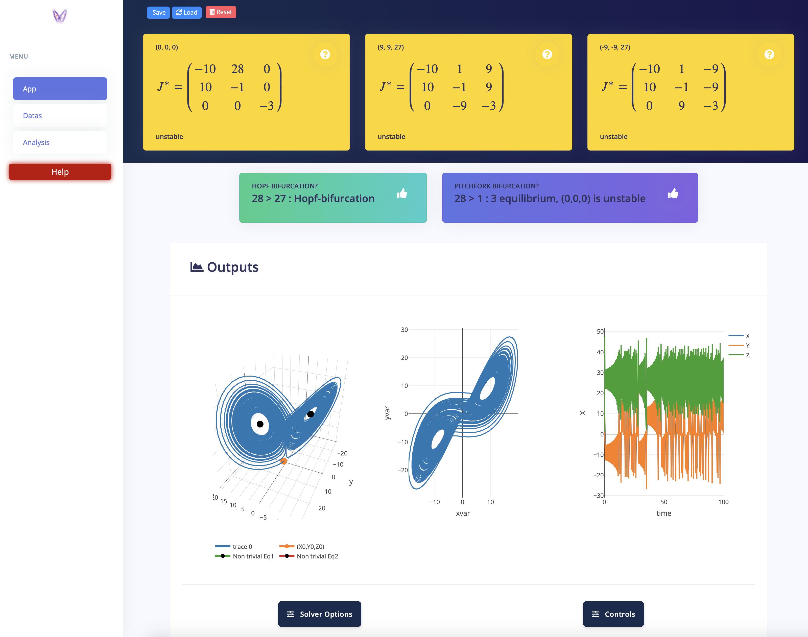
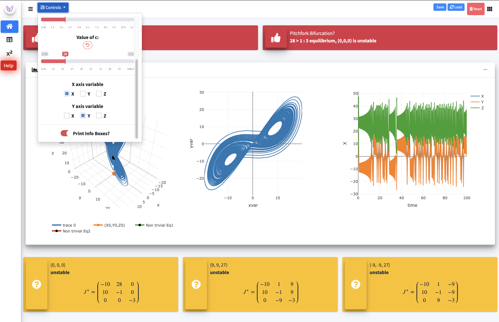

# Lorenz_Apps

> This app deals with the famous [Lorenz attractor](https://en.wikipedia.org/wiki/Lorenz_system).
Through this app, you will be able to explore the impact of changing parameters on the model dynamics, stability and bifurcations. If you are not familiar with the underlying equations, an info section is available.

## Useful Links:

* [**bs4Dash Lorenz**](https://divadnojnarg.shinyapps.io/bs4Lorenz/)
* [**argonDash Lorenz**](https://divadnojnarg.shinyapps.io/argonLorenz/)
* [**Github**](https://github.com/DivadNojnarg/Lorenz_Apps)
* RStudio Cloud -&gt; soon

There are similar apps about the [**Lotka Volterra**](https://rinterface.com/shiny/showcase/lotkaVolterra/) systems in ecology for those who might be interested by this topic.

## Preview

There are two available designs.

## argonLorenz App

## bs4Lorenz App

## Technical details

### Computations

The model was written in C to speed up simulations. 

### Interface

This app is built upon 2 different templates, namely [**bs4Dash**](https://github.com/RinteRface/bs4Dash) and [**argonDash**](https://github.com/RinteRface/argonDash), belonging to the [**RinteRface**](https://rinterface.com) project.

### Modularization

Each part of the code has its own dedicated module. There are currently 9 modules, among them:

- the computeLorenz module contains all input necessary to calculations such as the integration time, time step, ... It returns a dataframe containing the solutions as well as some useful reactive functions, ready to be imported by other modules.
- the plotLorenz module, dedicated to plot results. I chose the Plotly library as it is well adapted for mobiles. 
- see the code for other modules

This app is able to detect whether it runs on a desktop/laptop or mobile device. Therefore the layout adapts to each platform. For mobiles, results are displayed in a tabBox, mainly to save space.
